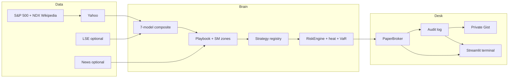

# QuantTrader

**Paper-only autonomous US-equity desk.** A Streamlit terminal that scans S&P 500 + Nasdaq-100 (~550 names), scores each with a 7-model composite, runs a 5-gate playbook, and will only paper-trade what survives a veto stack: risk limits, transaction-cost gate, correlation, book heat, drawdown circuit breaker, and strategy incubation.

It is **not a hedge fund, not live brokerage, not financial advice.** Paper fills, Yahoo (and optional LSE) data, persistence via a private GitHub Gist so Streamlit Cloud restarts do not wipe the book.

Live demo (owner): [github.com/siibi123/quanttrader](https://github.com/siibi123/quanttrader)

---

## What it actually does

Every **5 minutes while the US cash session is open**, the scheduler runs one decision cycle over the full universe:

1. **Score** the name (trend, momentum, B-Xtrender, MACD, RSI, mean-reversion, volume → composite in `[-1, +1]`).
2. **Playbook** — five entry gates + discount/premium zone + weekly B-X alignment + market mode (expansion / compression / capitulation). Output is one instruction: `ACTIONABLE` / `STALK` / `TIGHTEN` / `EXIT` / `STAND DOWN`.
3. **Size** the ticket from the setup (zone, structure stop, model agreement, news, book overlap, macro calendar) **under a 1% AUM hard cap**. A scalp is smaller than a 5/5 buy-zone swing.
4. **Veto** — RiskEngine can block. Nothing executes without `APPROVE` in the audit log.
5. **Paper fill** — next-bar style mark, spread-based slippage, commission. Stops trail; they never ratchet down.
6. **Log** — every propose, veto, fill, trail, and desk refresh is append-only.

New entries start in **INCUBATION**. Signals are logged with a 10-day forward horizon. Promotion to paper trading requires ≥20 settled signals **and** a bootstrap 90% CI on those forward returns that excludes zero (deflated Sharpe is recorded next to the decision). Exits are never gated — closing risk is always allowed.

---

## Architecture



| Layer | Path | Job |
|---|---|---|
| Terminal | [`app.py`](app.py) | Streamlit UI. Chart / Metrics / Trades / Research / Audit. |
| Orchestrator | [`ai/orchestrator.py`](ai/orchestrator.py) | One `step()` = scan → propose → review → execute. Auto desk refresh. |
| Broker + risk | [`core/engine.py`](core/engine.py) | Paper book, vetoes, trail stops, heat cap (6% of equity if all stops hit). |
| Scheduler | [`core/scheduler.py`](core/scheduler.py) | Decision cycle 5 min (RTH), morning note 09:25 ET, close report 16:05 ET. |
| Registry | [`core/strategy_registry.py`](core/strategy_registry.py) | Incubation → paper promotion. |
| Persistence | [`core/gist_store.py`](core/gist_store.py) | `runtime/*` ↔ private gist (`GITHUB_TOKEN`). |
| Signals | [`quant/signals.py`](quant/signals.py) | Composite + weights. |
| Playbook | [`quant/playbook.py`](quant/playbook.py) | Gates, urgency, instruction. |
| Zones | [`quant/sm_zones.py`](quant/sm_zones.py) | Discount / OTE / premium, market mode. |
| Sizing | [`quant/setup_risk.py`](quant/setup_risk.py) | Per-trade risk, structure stop. |
| Name study | [`quant/desk_read.py`](quant/desk_read.py) | Who drives the score, walk-forward verdict, vs buy-and-hold. |
| Scorecard | [`quant/scorecard.py`](quant/scorecard.py) | Book vs SPY, expectancy, heat. |
| Universe | [`data/universe.py`](data/universe.py) | Cached S&P 500 + Nasdaq-100. |

The chart symbol in the sidebar is **display only**. The cycle always scans the full loaded universe.

---

## Terminal (what you see)

| Tab | What it is for |
|---|---|
| **CHART** | Candles + fills for one name. **Name study**: weighted model attribution (BROAD / NARROW / COUNTERTREND), walk-forward verdict (ROBUST / UNSTABLE / FRAGILE), strategy equity vs sitting in the name. |
| **METRICS** | PM scorecard: book return, SPY, **excess vs SPY**, heat-to-stops, win %, expectancy, profit factor. Then live signals (non-NONE only). |
| **TRADES** | Open book with live stops. Entries and exits **split**, each with the reason string. Ranked **alternatives** the sector engine likes that you do not hold. |
| **RESEARCH** | Auto-filled desk: stress VaR, execution quality, flow confluence, vol-surface findings if LSE is keyed. No buttons required. |
| **AUDIT** | Append-only who / action / model / why. Vetoes in red. This is the source of truth. |

The desk sizes tickets. Configuration is a **silent 1% AUM cap**, not a per-trade slider. Discount-zone filter defaults on (do not buy premium).

---

## Signal stack (the “QuantSignal brain”)

Each model scores `[-1, +1]`. Composite is a weighted sum, then damped in a volatility storm.

| Weight | Model |
|---:|---|
| 0.25 | Trend (SMA 50 / 200) |
| 0.20 | Momentum (12-1) |
| 0.15 | B-Xtrender (daily + weekly alignment) |
| 0.125 | MACD |
| 0.10 | RSI regime |
| 0.10 | Bollinger mean-reversion |
| 0.075 | Volume confirmation |

`score ≥ +0.25` → BUY, `≤ −0.25` → SELL, else HOLD. Playbook still requires the other gates and, with the discount filter on, price in the 0.618–0.786 pocket of the last swing — not paying premium.

Backtests in [`quant/backtest.py`](quant/backtest.py) execute at **next-bar open** (no look-ahead), with commission, ATR trail, vol targeting, and a 4-fold walk-forward. Walk-forward **last fold** is what the CHART labels ROBUST vs FRAGILE. Full-sample Sharpe is vanity if the latest window is dead.

---

## Risk — what can stop a trade

A BUY dies if any of these fail (SELL / exit is not blocked by incubation or “risk-reducing only” gates):

- Position / gross / cash / AUM caps
- Expected edge must be ≥ **2×** expected cost (spread + commission)
- Portfolio parametric VaR cap
- **Book heat** — dollars to every stop, including this ticket, ≤ 6% of equity
- Daily loss limit (then only risk-reducing orders)
- Drawdown circuit breaker (size cut → risk-reducing only → halt until a written reset)
- Correlation policy (crowded book haircuts size)
- Stress cache (Monte Carlo of the current book; elevated → 50% size)
- HMM regime: storms block dip-chasing; cache + per-cycle refit budget so ~550 names stay affordable
- Strategy still in INCUBATION (bypass exists for a cold start, forced on until 20 signals are logged, then the owner can turn it off)

Every veto is an audit row. There is no silent skip.

---

## Cadence

| When | Job |
|---|---|
| Every 5 min, RTH only | Decision cycle over the universe + desk refresh (sector rank, flow on the book, execution quality, SPY, stress if the book has ≥2 names) |
| 09:25 ET weekdays | Morning briefing |
| 16:05 ET weekdays | Daily institutional report |
| Quotes | Polling feed, market-hours gated |

Streamlit Cloud **sleeps**. The cycle runs while the app is awake. Gist persistence means a reboot restores the book; it does not mean 24/7 colocation.

---

## Run locally

Python 3.10+.

```bash
git clone https://github.com/siibi123/quanttrader.git
cd quanttrader
python -m venv .venv
source .venv/bin/activate          # Windows: .venv\Scripts\activate
pip install -r requirements.txt
cp .env.example .env               # optional keys
streamlit run app.py
```

Open [http://localhost:8501](http://localhost:8501).

```bash
python tests/test_core.py          # 196 checks, no network required
```

---

## Streamlit Cloud

1. Deploy `app.py` from this repo.
2. **Secrets** (TOML) — at minimum the gist token so the book survives reboots:

```toml
GITHUB_TOKEN = "ghp_..."
# GIST_ID = "optional_if_you_already_have_one"
```

Token: [github.com/settings/tokens](https://github.com/settings/tokens) → classic → **gist scope only**.

| Secret | Required | Purpose |
|---|---|---|
| `GITHUB_TOKEN` | Cloud: yes | Persist `runtime/broker.json`, audit, registry |
| `GIST_ID` | no | Pin an existing private gist named `quanttrader-runtime` |
| `LSE_API_KEY` | no | Options chain, flow, macro, vol surface |
| `NEWS_API_KEY` | no | Headline tilt on sizing |
| `ANTHROPIC_API_KEY` | no | Reserved; live path is the rule orchestrator, not an LLM |
| `STARTING_CASH` | no | Default `10000` |
| `PORTFOLIO_AUM` | no | `0` = use live paper equity as the cap basis |
| `RISK_MAX_*` | no | Position / gross / daily loss / VaR caps |

The TRADES tab shows **Last saved to GitHub · … UTC** after the first fill. No token = local `runtime/` only (wiped on Cloud reboot).

---

## Honest limits

- **Paper.** Interactive Brokers (or any live port) is not wired. Connecting a live account without a long incubated track record is how you donate money to slippage.
- **Yahoo is free data.** Splits/dividends are whatever yfinance adjusted closes give you. No borrow, no locates, no corporate-action desk.
- **Slippage** is half-spread estimated from bars (clamped ~3–80 bps), not a live tape.
- **Excess vs SPY** on Metrics is *this process*, not an audited inception track record.
- **Walk-forward skipped on 1h** (too heavy). Use 1d / 1wk for the name study.
- Public technical rules + a veto stack ≠ proprietary alpha. The value is **discipline**: defined entry, defined exit, defined risk, a log you cannot rewrite.

---

## Layout

```
app.py                 Streamlit terminal
ai/orchestrator.py     Decision cycle
core/                  Broker, risk, scheduler, gist, registry, state
data/                  Yahoo + LSE providers, news, universe
quant/                 Signals, playbook, zones, backtest, risk models
tests/test_core.py     Deterministic suite (FakeProvider)
runtime/               Live book / audit (gitignored; restored from gist)
reports/               Morning + close markdown (scheduler)
```

---

## Constitution (short)

Paper only. Secrets in env, never in git. Every order through RiskEngine. Every decision in the audit log. `NO TRADE` is the default. If a number cannot be explained, it is not shown.

This is a desk for learning how a systematic book should *behave*. It is not a product that owes you returns.
